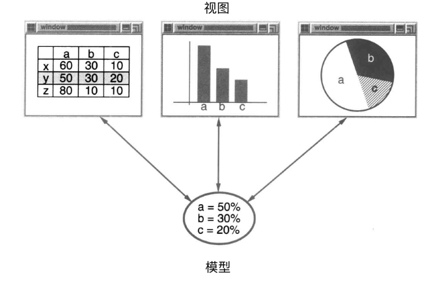
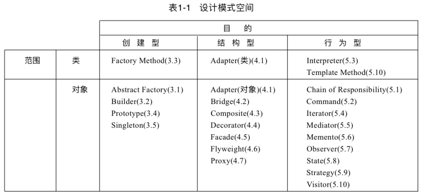
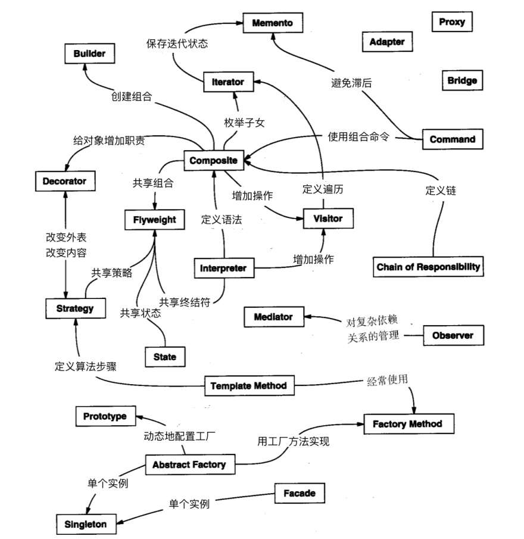
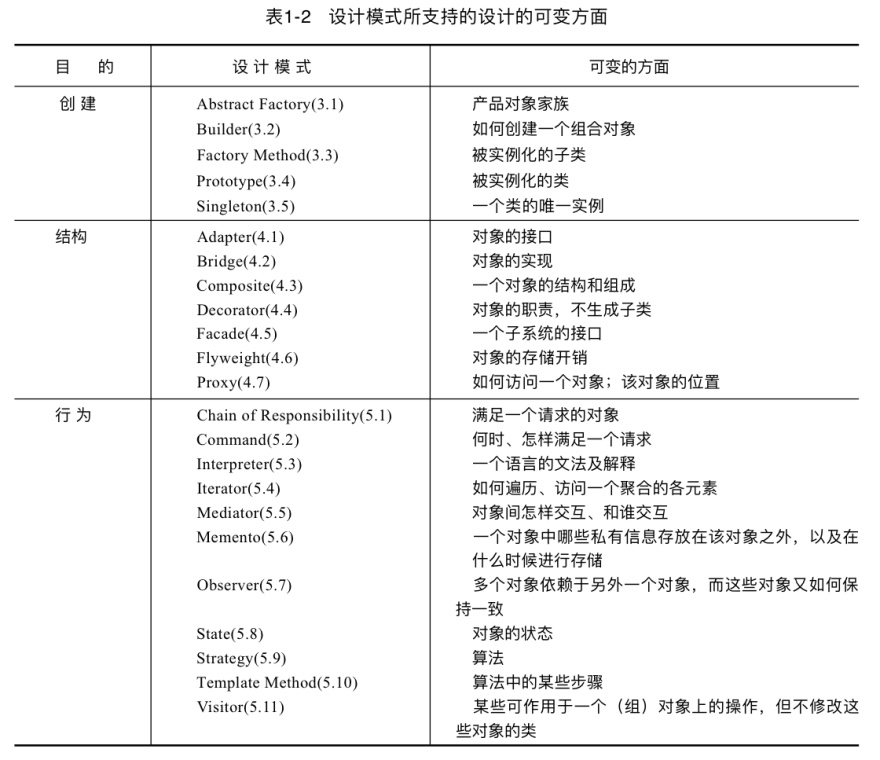

# 引言

设计面向对象软件比较困难，而设计可复用的面向对象软件就更加困难。你必须找到相关的对象，以适当的粒度将它们归类，再定义类的接口和继承层次，建立对象之间的基本关系。你的设计应该对手头的问题有针对性，同时对将来的问题和需求也要有足够的通用性。

你也希望避免重复设计或尽可能少做重复设计。

不是解决任何问题都要从头做起。他们更愿意复用以前使用过的解决方案。

小说家和剧本作家很少从头开始设计剧情。他们总是沿袭一些业已存在的模式

我们都知道设计经验的重要价值。你曾经多少次有过这种感觉一你已经解决过了一个问题但就是不能确切知道是在什么地方或怎么解决的？如果你能记起以前问题的细节和怎么解决它的，你就可以复用以前的经验而不需要重新发现它。然而，我们并没有很好记录下可供他人使用的软件设计经验。

> 提炼，如何抽象出设计模式

设计模式使人们可以更加简单方便地复用成功的设计和体系结构。

## 什么是设计模式

每一个模式描述了一个在我们周围不断重复发生的问题， 以及该问题的解决方案的核心。这样，你就能一次又一次地使用该方案而不必做重复劳动

- 模式有四个基本要素

- 模式名称（pattern name) 
> 一个助记名，它用一两个词来描述模式的问题、解决方案和效果。命名一个新的模式增加了我们的设计词汇。**设计模式允许我们在较高的抽象层次上进行设计**。基于一个模式词汇表，我们自己以及同事之间就可以讨论模式并在编写文档时使用它们。模式名可以帮助我们思考，便于我们与其他人交流设计思想及设计结果。找到恰当的模式名也是我们设计模式编目工作的难点之一。

- 问题(problem)
> 描述了应该在何时使用模式。**它解释了设计问题和问题存在的前因后果**，它可能描述了特定的设计问题，如怎样用对象表示算法等。也可能描述了导致不灵活设计的类或对象结构。有时候，问题部分会包括使用模式必须满足的一系列先决条件。
> 
> 相当于知识背景

- 解决方案(solution)
> 描述了设计的组成成分，它们之间的相互关系及各自的职责和协作方式。因为模式就像一个模板，可应用于多种不同场合，所以解决方案并不描述一个特定而具体的设计或实现，而是提供设计问题的抽象描述和怎样用一个具有一般意义的元素组合(类或对象组合)来解决这个问题。

- 效果(consequences)
> 描述了模式应用的效果及使用模式应权衡的问题。尽管我们描述设计决策时，并不总提到模式效果，但它们对于评价设计选择和理解使用模式的代价及好处具有重要意义。软件效果大多关注对时间和空间的衡量，它们也表述了语言和实现问题。因为复用是面向对象设计的要素之一，所以模式效果包括它对系统的灵活性、扩充性或可移植性的影响，显式地列出这些效果对理解和评价这些模式很有帮助。
> 
> 总是有利弊权衡

出发点的不同会产生对什么是模式和什么不是模式的理解不同。一个人的模式对另一个人来说可能只是基本构造部件。

## Smalltalk MVC中的设计模式

类的模型/视图/控制器（Model//View/Controller)三元组(MVC)被用来构建用户界面。

模型Model是应用对象，视图View是它在屏幕上的表示，控制器Controller定义用户界面对用户输入的响应方式。

不使用MVC,用户界面设计往往将这些对象混在一起，而MVC则将它们分离以提高灵活性和复用性。

- MVC通过建立一个“订购/通知”协议来分离视图和模型。

一旦模型的数据发生变化,模型将通知有关的视图

表面上看，这个例子反映了将视图和模型分离的设计，然而这个设计还可用于解决更一般的问题：**将对象分离**，使得一个对象的改变能够影响另一些对象，而这个对象并不需要知道那些被影响的对象的细节。这个更一般的设计被描述成Observer（5.7)模式。

- MVC的另一个特征是视图可以嵌套

MVC用View类的子类一Composite View类来支持嵌套视图。Composite View类的对象行为上类似于Viw类对象，一个组合视图可用于任何视图可用的地方，但是它包含并管理嵌套视图。

上例反映了可以将组合视图与其构件平等对待的设计，同样地，该设计也适用于更一骰的问题：将一些对象划为一组，并将该组对象当作一个对象来使用。这个设计被描述为Composite（4.3)模式，该模式允许你创建一个类层次结构，一些子类定义了原子对象（如Button)而其他类定义了组合对象（CompositeView),这些组合对象是由原子对象组合而成的更复杂的对象。

- MVC允许你在不改变视图外观的情况下改变视图对用户输入的响应方式。

View使用Controller子类的实例来实现一个特定的响应策略。要实现不同的响应策略只要用不同种类的Controller实例替换即可。甚至可以在运行时刻通过改变View的Controller来改变View对用户输入的响应方式。例如，一个Viw可以被禁止接收任何输入，只需给它一个忽略输入事件的Controller。

View-Controller关系是Strategy（5.9)模式的一个例子。一个策略是一个表述算法的对象。当你想静态或动态地替换一个算法，或你有很多不同的算法，或算法中包含你想封装的复杂数据结构，这时策略模式是非常有用的。

## 描述设计模式

我们怎样描述设计模式呢？图形符号虽然很重要也很有用，却还远远不够，它们只是将设计过程的结果简单记录为类和对象之间的关系。为了达到设计复用，我们必须同时记录设计产生的决定过程、选择过程和权衡过程。具体的例子也是很重要的，它们让你看到实际的设计。

- 模式名和分类模式名
> 简洁地描述了模式的本质。一个好的名字非常重要，因为它将成为你的设计词汇表中的一部分。

- 意图
> 是回答下列问题的简单陈述：设计模式是做什么的？它的基本原理和意图是什么？它解决的是什么样的特定设计问题？ 别名模式的其他名称。

- 动机
> 用以说明一个设计问题以及如何用模式中的类、对象来解决该问题的特定情景。该情景会帮助你理解随后对模式更抽象的描述。

- 适用性
> 什么情况下可以使用该设计模式？该模式可用来改进哪些不良设计？你怎样识别这些情况？ 

- 结构
> 采用基于对象建模技术的表示法对模式中的类进行图形描述。我们也使用了交互图来说明对象之间的请求序列和协作关系。

- 参与者
> 指设计模式中的类和/或对象以及它们各自的职责。

- 协作
> 模式的参与者怎样协作以实现它们的职责。

- 效果
> 模式怎样支持它的目标？使用模式的效果和所需做的权衡取舍？系统结构的哪些方面可以独立改变？ 

- 实现
> 实现模式时需要知道的一些提示、技术要点及应避免的缺陷，以及是否存在某些特定于实现语言的问题。

- 代码示例
> 用来说明怎样用C++或Smalltalk实现该模式的代码片段。

- 已知应用
> 实际系统中发现的模式的例子。每个模式至少包括了两个不同领域的实例。

- 相关模式
> 与这个模式紧密相关的模式有哪些？其间重要的不同之处是什么？这个模式应与哪些其他模式一起使用？

## 设计模式的编目

- Abstract Factory(3.1):
> 提供一个创建一系列相关或相互依赖对象的接口，而无需指定它们具体的类。
- Adapter(4.1):
> 将一个类的接口转换成客户希望的另外一个接口。Adapter模式使得原本由于接口不兼容而不能一起工作的那些类可以一起工作。
- Bridge(4.2):
> 将抽象部分与它的实现部分分离，使它们都可以独立地变化。
- Builder(3.2):
> 将一个复杂对象的构建与它的表示分离，使得同样的构建过程可以创建不同的表示。
- Chain of Responsibility(5.1):
> 为解除请求的发送者和接收者之间耦合，而使多个对象都有机会处理这个请求。将这些对象连成一条链，并沿着这条链传递该请求，直到有一个对象处理它。
- Command(5.2):
> 将一个请求封装为一个对象，从而使你可用不同的请求对客户进行参数化；对请求排队或记录请求日志，以及支持可取消的操作。
- Composite(4.3):
> 将对象组合成树形结构以表示“部分-整体”的层次结构。Composite使得客户对单个对象和复合对象的使用具有一致性。
- Decorator(4.4):
> 动态地给一个对象添加一些额外的职责。就扩展功能而言，Decorator模式比生成子类方式更为灵活。
- Facade(4.5):
> 为子系统中的一组接口提供一个一致的界面，Facade模式定义了一个高层接口，这个接口使得这一子系统更加容易使用。
- Factory Method(3.3):
> 定义一个用于创建对象的接口，让子类决定将哪一个类实例化。Factory Method使一个类的实例化延迟到其子类。
- Flyweight((4.6):
> 运用共享技术有效地支持大量细粒度的对象。
- Interpreter(5.3):
> 给定一个语言，定义它的文法的一种表示，并定义一个解释器，该解释器使用该表示来解释语言中的句子。
- Iterator(5.4):
> 提供一种方法顺序访问一个聚合对象中各个元素，而又不需暴露该对象的内部表示。
- Mediator(5.5):
> 用一个中介对象来封装一系列的对象交互。中介者使各对象不需要显式地相互引用，从而使其耦合松散，而且可以独立地改变它们之间的交互。
- Memento(5.6):
> 在不破坏封装性的前提下，捕获一个对象的内部状态，并在该对象之外保存这个状态。这样以后就可将该对象恢复到保存的状态。
- Observer(5.7):
> 定义对象间的一种一对多的依赖关系，以便当一个对象的状态发生改变时， 所有依赖于它的对象都得到通知并自动刷新。
- Prototype(3.4):
> 用原型实例指定创建对象的种类，并且通过拷贝这个原型来创建新的对象。
- Proxy(4.7):
> 为其他对象提供一个代理以控制对这个对象的访问。
- Singleton(3.5):
> 保证一个类仅有一个实例，并提供一个访问它的全局访问点。
- State(5.8):
> 允许一个对象在其内部状态改变时改变它的行为。对象看起来似乎修改了它所属的类。
- Strategy(5.9):
> 定义一系列的算法，把它们一个个封装起来，并且使它们可相互替换。本模式使得算法的变化可独立于使用它的客户。
- Template Method(5.10):
> 定义一个操作中的算法的骨架，而将一些步骤延迟到子类中。Template Method使得子类可以不改变一个算法的结构即可重定义该算法的某些特定步骤。
- Visitor(5.11):
> 表示一个作用于某对象结构中的各元素的操作。它使你可以在不改变各元素的类的前提下定义作用于这些元素的新操作。

## 组织编目

设计模式在粒度和抽象层次上各不相同

## 设计模式怎样解决设计问题

### 寻找合适的对象

你可以写出一个问题描述，挑出名词和动词， 进而创建相应的类和操作；或者，你可以关注于系统的协作和职责关系；或者，你可以对现实世界建模，再将分析时发现的对象转化至设计中。至于哪一种方法最好，并无定论。

严格反映当前现实世界的模型并不能产生也能反映将来世界的系统。设计中的抽象对于产生灵活的设计是至关重要的。

### 决定对象的粒度

### 指定对象接口

两个有相同接口的对象可以有完全不同的实现。

动态绑定是指发送的请求直到运行时刻才受你的具体的实现的约束。因而，在知道任何有正确接口的对象都将接受此请求时，你可以写一个一般的程序，它期待着那些具有该特定接口的对象。进一步讲，动态绑定允许你在运行时刻彼此替换有相同接口的对象。这种可替换性就称为多态(polymorphism),它是面向对象系统中的核心概念之一。多态允许客户对象仅要求其他对象支持特定接口，除此之外对其假设几近于无。多态简化了客户的定义，使得对象间彼此独立，并可以在运行时刻动态改变它们相互的关系。

### 描述对象的实现

- 类的实例化
- 父子类
- 抽象类
- 混入类
> 给其他类提供可选择的接口或功能的类。

- 类继承和接口继承
> 接口继承 (或子类型化)描述了一个对象什么时候能被用来替代另一个对象。

继承既指接口的继承又指实现的继承。

C++中接口继承的标准方法是公有继承一个含（纯）虚成员函数的类。C++中纯接口继承接近于公有继承纯抽象类，纯实现继承或纯类继承接近于私有继承。

- 对接口编程,而不是对实现编程

> - 客户无须知道他们使用对象的特定类型，只须对象有客户所期望的接口。
> - 客户无须知道他们使用的对象是用什么类来实现的，他们只须知道定义接口的抽象类。

不将变量声明为某个特定的具体类的实例对象,而是让它遵从抽象类所定义的接口。

通过抽象对象的创建过程,创建型模式提供不同方式以在实例化时建立接口和实现的透明连接。创建型模式确保你的系统是采用针对接口的方式书写的,而不是针对实现而书写的。

### 运用复用机制

#### 继承和组合的比较

类继承允许你根据其他类的实现来定义一个类的实现。这种通过生成子类的复用通常被称为白箱复用(white-box reuse)。术语“白箱”是相对可视性而言：在继承方式中，父类的内部细节对子类可见。

对象组合要求被组合的对象具有良好定义的接口。这种复用风格被称为黑箱复用(black-box reuse),因为对象的内部细节是不可见的。对象只以“黑箱”的形式出现。

基于对象组合的设计会有更多的对象（而有较少的类），且系统的行为将依赖于对象间的关系而不是被定义在某个类中。

优先使用对象组合,而不是类继承。我们的经验表明:设计者往往过度使用了继承这种复用技术。但依赖于对象组合技术的设计却有更好的复用性 (或更简单)。

#### 委托

委托(delegation)是一种组合方法，它使组合具有与继承同样的复用能力。在委托方式下，有两个对象参与处理一个请求，接受请求的对象将操作委托给它的代理者(delegate)。

eg. 

在State模式中，一个对象将请求委托给一个描述当前状态的State对象来处理。在Strategy模式中，一个对象将一个特定的请求委托给一个描述请求执行策略的对象，一个对象只会有一个状态，但它对不同的请求可以有许多策略。这两个模式的目的都是通过改变受托对象来改变委托对象的行为。
在Visitor中，对象结构的每个元素上的操作总是被委托到Visitor对象。

#### 继承和参数化类型的比较

对象组合技术允许你在运行时刻改变被组合的行为， 但是它存在间接性，比较低效。继承允许你提供操作的缺省实现，并通过子类重定义这些操作。参数化类型允许你改变类所用到的类型。但是继承和参数化类型都不能在运行时刻改变。
哪一种方法最佳，取决于你设计和实现的约束条件。

### 关联运行时刻和编译时刻的结构

一个面向对象程序运行时刻的结构通常与它的代码结构相差较大。代码结构在编译时刻就被确定下来了，它由继承关系固定的类组成。而程序的运行时刻结构是由快速变化的通信对象网络组成。事实上两个结构是彼此独立的，试图由一个去理解另一个就好像试图从静态的动、植物分类去理解活生生的生态系统的动态性。反之亦然。

- 聚合(aggregation)
聚合意味着聚合对象和其所有者具有相同的生命周期。

- 相识(acquaintance)
相识意味看一个对象仅仅知道另一个对象。有时相识也被称为“关联”或“引用”关系。

### 设计应支持变化

获得最大限度复用的关键在于对新需求和已有需求发生变化时的预见性,要求你的系统设计要能够相应地改进。

#### 重新设计的一般原因

- 通过显式地指定一个类来创建对象
> 在创建对象时指定类名将使你受特定实现的约束而不是特定接口的约束。这会使未来的变化更复杂。要避免这种情况，应该间接地创建对象。
> 
> 设计模式：Abstract Factory(3.l),Factory Method(3.3),Prototype(3.4)。

- 对特殊操作的依赖
> 当你为请求指定一个特殊的操作时，完成该请求的方式就固定下来了。为避免把请求代码写死，你将可以在编译时刻或运行时刻很方便地改变响应请求的方法。
> 
> 设计模式：Chain of Resposibility(5.l),Command(5.2)。

- 对硬件和软件平台的依赖
> 外部的操作系统接口和应用编程接口(API)在不同的软硬件平台上是不同的。依赖于特定平台的软件将很难移植到其他平台上，甚至都很难跟上本地平台的更新。所以设计系统时限制其平台相关性就很重要了。
> 
> 设计模式：Abstract Factory(3.1),Bridge(4.2)。

- 对对象表示或实现的依赖
> 知道对象怎样表示、保存、定位或实现的客户在对象发生变化时可能也需要变化。对客户隐藏这些信息能阻止连锁变化。
> 
>设计模式：Abstract Factory(3.1),Bridge(4.2),Memento(5.6),Proxy(4.7) 

- 算法依赖
> 算法在开发和复用时常常被扩展、优化和替代。依赖于某个特定算法的对象在算法发生变化时不得不变化。因此有可能发生变化的算法应该被孤立起来。
> 
>设计模式：Builder(3.2),Iterator(5.4),Strategy(5.9),Template Method(5.10), Visitor(5.11) 

- 紧耦合
> 紧耦合的类很难独立地被复用，因为它们是互相依赖的。紧耦合产生单块的系统，要改变或删掉一个类，你必须理解和改变其他许多类。这样的系统是一个很难学习、移植和维护的密集体。
> 
> 松散耦合提高了一个类本身被复用的可能性，并且系统更易于学习、移植、修改和扩展。设计模式使用抽象耦合和分层技术来提高系统的松散耦合性。
> 
> 设计模式：Abstract Factory(3.l),Command(5.2),Facade(4.5),Mediator(5.5), Observer(5.7),Chain of Responsibility(5.1).
- 通过生成子类来扩充功能
> 通常很难通过定义子类来定制对象。每一个新类都有固定的实现开销（初始化、终止处理等）。定义子类还需要对父类有深入的了解。如，重定义一个操作可能需要重定义其他操作。一个被重定义的操作可能需要调用继承下来的操作。并且子类方法会导致类爆炸，因为即使对于一个简单的扩充，你也不得不引入许多新的子类。
> 
> 一般的对象组合技术和具体的委托技术，是继承之外组合对象行为的另一种灵活方法。
> 新的功能可以通过以新的方式组合已有对象，而不是通过定义已存在类的子类的方式加到应用中去。另一方面，过多使用对象组合会使设计难于理解。许多设计模式产生的设计中，你可以定义一个子类，且将它的实例和已存在实例进行组合来引入定制的功能。
> 
> 设计模式：Bridge(4.2),Chain of Responsibility(5.l),Composite(4.3),Decorator(4.4), Observer(5.7),Strategy(5.9).

- 不能方便地对类进行修改
> 有时你不得不改变一个难以修改的类。也许你需要源代码而又没有（对于商业类库就有这种情况），或者可能对类的任何改变会要求修改许多已存在的其他子类。设计模式提供在这些情况下对类进行修改的方法。
> 
> 设计模式：Adapter(4.1),Decorator(4.4),Visitor((5.11)。

#### 应用

- 应用程序(Application Program)
> 内部复用性、可维护性和可扩充性是要优先考虑的。
> 内部复用性确保你不会做多余的设计和实现。设计模式通过减少依赖性来提高内部复用性。松散耦合也增强了一类对象与其他多个对象协作的可能性。
> 
> 当设计模式被用来对系统分层和限制对平台的依赖性时，它们还会使一个应用更具可维护性。
> 
> 通过显示怎样扩展类层次结构和怎样使用对象复用，它们可增强系统的易扩充性。同时，耦合程度的降低也会增强可扩充性。

- 工具箱(Toolkit)
> 工具箱是一组相关的、可复用的类的集合,这些类提供了通用的功能。
> 工具箱并不强制应用采用某个特定的设计,它们只是为你的应用提供功能上的帮助。工具箱强调的是代码复用,它们是面向对象环境下的“子程序库” 。

- 框架(Framework)
> 是构成一类特定软件可复用设计的一组相互协作的类
> 
> 框架规定了你的应用的体系结构。它定义了整体结构，类和对象的分割，各部分的主要责任，类和对象怎么协作，以及控制流程。框架预定义了这些设计参数，以便于应用设计者或实现者能集中精力于应用本身的特定细节。框架记录了其应用领域的共同的设计决策。因而框架更强调设计复用，尽管框架常包括具体的立即可用的子类。
> 
> 这个层次的复用导致了应用和它所基于的软件之间的反向控制(inversion of control)。当你使用工具箱（或传统的子程序库）时，你需要写应用软件的主体并且调用你想复用的代码。而当你使用框架时，你应该复用应用的主体，写主体调用的代码。你不得不以特定的名字和调用约定来写操作地实现，但这会减少你需要做出的设计决策。
> 
> 你不仅可以更快地建立应用，而且应用还具有相似的结构。它们很容易维护，且用户看来也更一致。另一方面，你也失去了一些表现创造性的自由，因为许多设计决策无须你来作出。

任何对框架设计的实质性修改都会大大降低框架所带来的好处,因为框架对应用的最主要贡献在于它所定义的体系结构。因此设计的框架必须尽可能地灵活、可扩充。

#### 模式和框架

- 设计模式比框架更抽象
> 框架能够用代码表示，而设计模式只有其实例才能表示为代码。框架的威力在于它们能够使用程序设计语言写出来，它们不仅能被学习，也能被直接执行和复用。而本书中的设计模式在每一次被复用时，都需要被实现。设计模式还解释了它的意图、权衡和设计效果。

- 框架比设计模式更加特例化
> 框架总是针对一个特定的应用领域。一个图形编辑器框架可能被用于一个工厂模拟,但它不会被错认为是一个模拟框架。

框架变得越来越普遍和重要。它们是面向对象系统获得最大复用的方式。

## 怎样选择设计模式

- 考虑设计模式是怎样解决设计问题的
- 检查重新设计的原因
> 考虑[问题](#重新设计的一般原因)所运用的方法
- 浏览模式的意图部分
> 考虑模式的作用
- 研究模式怎样互相关联
> 查看模式之间关系图
- 研究目的相似的模式
> 比较和对照`创建型模式`，`结构型模式`，`行为型模式`

- 考虑你的设计中哪些是可变的
> 它不是考虑什么会迫使你的设计改变,而是考虑你想要什么变化却又不会引起重新设计。最主要的一点是封装变化的概念

可以改变它们而又不会导致重新设计

## 怎样使用设计模式

这里给出一个有效应用设计模式的循序渐进的方法。

- 大致浏览一遍模式
> 特别注意其适用性部分和效果部分,确定它适合你的问题
- 回头研究结构部分、参与者部分和协作部分
> 确保你理解这个模式的类和对象以及它们是怎样关联的。
- 看代码示例部分
> 看看这个模式代码形式的具体例子 研究代码将有助于你实现模式。
- 选择模式参与者的名字,使它们在应用上下文中有意义
> 设计模式参与者的名字通常过于抽象而不会直接出现在应用中。然而，将参与者的名字和应用中出现的名字合并起来是很有用的。这会帮助你在实现中更显式的体现出模式来。例如，如果你在文本组合算法中使用了Strategy模式，那么你可能有名为SimpleLayoutStrategy或TeXLayoutStrategy)这样的类。
- 定义类
> 声明它们的接口,建立它们的继承关系,定义代表数据和对象引用的实例变量。识别模式会影响到的你的应用中存在的类,做出相应的修改。
- 定义模式中专用于应用的操作名称
> 这里再一次体现出，名字一般依赖于应用。使用与每一个操作相关联的责任和协作作为指导。还有，你的名字约定要一致。例如，可以使用“Create”前缀统一标记Factory方法。
- 实现执行模式中责任和协作的操作
> 实现部分提供线索指导你进行实现。代码示例部分的例子也能提供帮助。

设计模式不能够随意使用。通常你通过引入额外的间接层次获得灵活性和可变性的同时，你也使设计变得更复杂并/或牺牲了一定的性能。一个设计模式只有当它提供的灵活性是真正需要的时候，才有必要使用。

