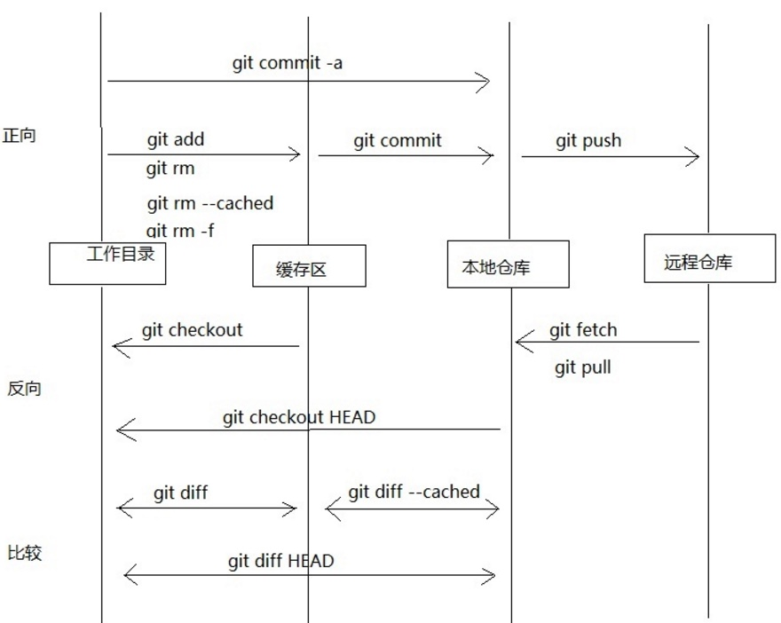

# git basic concept

## initialize repository

`git init` 将当前目录转化为`repository`

## check the status of repository

`git status`

## operate repository

- git add <file_name>

> 将文件提交到 stage，并且新建的文件将变成`track`状态
> 
> 意思也是如果新建文件，文件是`untracked`状态，切换分支的时候，此文件不会随着切换消失

- git commit

> [option:-m "simple message"]用一句简单的话描述
> 不添加`-m`，则会打开编辑器，`#`为注释
> 规范是: 
> 
> 第一行简单描述;
> 
> 第二行空白；
> 
> 第三行具体原因；
> 
> 如果提交信息空白，则中止提交

-  git 的结构如下

> add 是提交到暂存区域
> 
> commit 是将暂存区域提交到本地仓库

- command 与 workspace 如下

## view the log

`git log`

> `[option:--pretty=short]` 简短输出
> 
> `<file_name>` 关于指定的文件
> 
> `[option:-p]` 文件提交前后的差异
> 
> `[option: --graph]` 以图表形式查看分支

## view the difference

git diff命令可以查看工作树、暂存区、最新提交之间的差别

- `git diff`
> 查看当前工作树与暂存区的差别。

- `git diff HEAD`
> 查看与最新提交的差别，即工作目录与本地仓库的区别
> 
> HEAD是指向当前分支中最新一次提交的指针。

