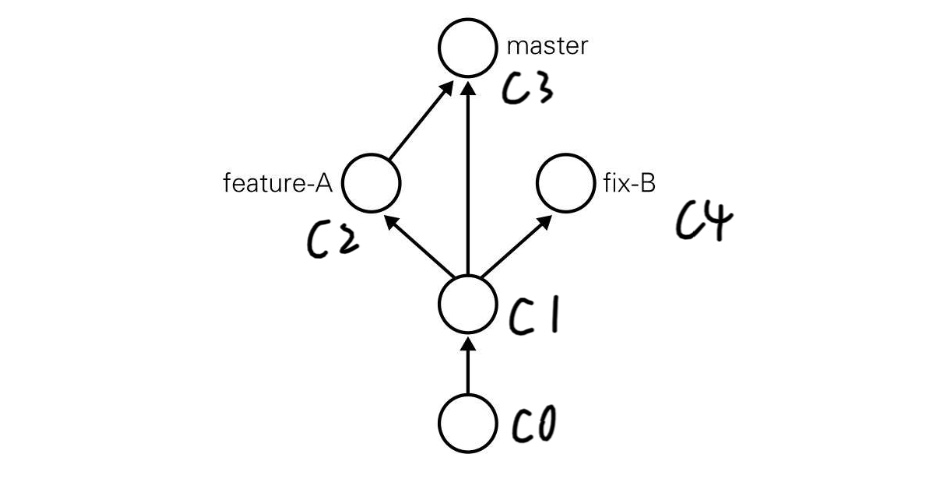

## reset

要让仓库的HEAD、暂存区、当前工作树回溯到指定状态，需要用到`git reset --hard`命令。只要提供目标时间点的哈希值，就可以完全恢复至该时间点的状态。

> 本质上是**当前分支**的指针指向了指定的节点

- git reset --hard <hash_id>

> `hash_id`通过`git log`来查阅，与`commit`是一一对应的



- 如上图创建`fix-B`
using [LearnGitBranching](http://pcottle.github.io/learnGitBranching/) to view the process
```bash
git reset C1 # 让 master 的指针指向 C1
git checkout -b fix-B # 创建 fix-B
git commit  # 提交一些工作
git checkout master # 切换分支指针为 master
git reset C3 #将 master 指针指向 C3
```

> 实际当中，回退的时候，会看不到后续分支 `hash_id`，
> 可以通过`git reflog`来查阅

## 压缩历史

[rebase 用法小结](https://www.jianshu.com/p/4a8f4af4e803)
