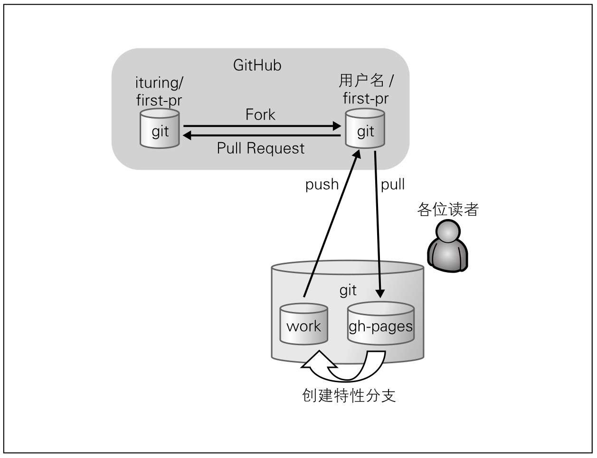
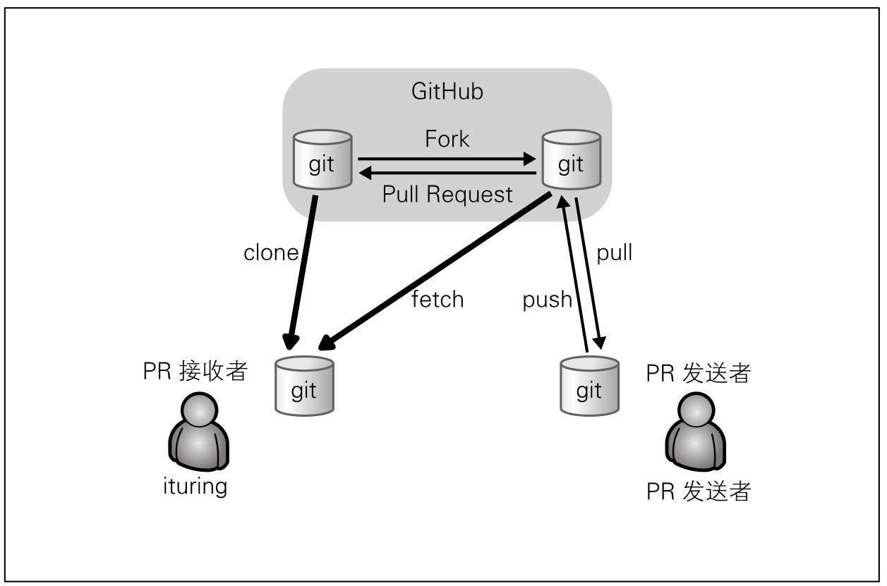

## send
在GitHub上发送Pull Request后，接收方的仓库会创建一个附带源代码的Issue，我们在这个Issue中记录详细内容。这就是Pull Request。

- 整体概念

- step
> 1. fork
> 2. clone to local
> 3. push
> 4. pull request
> 建议:新建一个分支，将新建的分支推送过去，由对面合并

实际开发过程中，这样做很可能导致一个功能在完成后才收到设计或实现方面的指正，从而使代码需要大幅更改或重新实现。
在GitHub上，我们可以尽早创建Pull Request，从审查中获得反馈，让大家在设计与实现方面思路一致，借此逐渐提高代码质量。

只要在想发起讨论时发送Pull Request即可，不必等代码最终完成。即便某个功能尚在开发之中，只要在Pull Request中附带一段简单代码让大家有个大体印象，就能获取不少反馈。如果在Pull Request中再加入直观易懂的Tasklist（请参照第5章的“Tasklist语法”），就能很清楚反映出哪些功能已经实现，将来要做哪些工作。这不但能加快审查者的工作效率，还能作为自己的备忘录使用。

向发送过Pull Request的分支添加提交时，该提交会自动添加至已发送的Pull Request中。

## receive
在采纳之前，请尽量将接收到的Pull Request拿到本地开发环境中进行检查，确认是否能够正常运行以及代码是否安全。
- 流程图

- clone and fetch sender's repository
- simulate merge
> 根据合并的目标分支，新建一个分支
> 
> 在新建分支中，合并源分支，进行测试
> 没有问题，可以直接在 GitHub 合并，也可以直接本地合并推送

