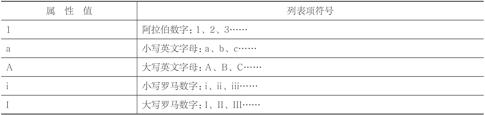

# 列表

- 有序列表

```html
<ol>
  <li>列表项</li>
  <li>列表项</li>
  <li>列表项</li>
</ol>
<!-- use type -->
<ol type="属性值">
  <li>列表项</li>
  <li>列表项</li>
  <li>列表项</li>
</ol>
```

> ol，即 ordered list（有序列表）。li，即 list（列表项）。
> 
>
> ol 标签和 li 标签是配合一起使用的，不可以单独使用，而且<ol>标签的子标签只能是 li 标签，不能是其他标签。

- 无序列表

  > ul，即 unordered list（无序列表）。li，即 list（列表项）。

- 定义列表
  > dl 即 definition list（定义列表），dt 即 definition term（定义名词），而 dd 即 definition description（定义描述）。

```html
<dl>
  <dt>HTML</dt>
  <dd>制作网页的标准语言，控制网页的结构</dd>
  <dt>CSS</dt>
  <dd>层叠样式表，控制网页的样式</dd>
  <dt>JavaScript</dt>
  <dd>脚本语言，控制网页的行为</dd>
</dl>
```


## html 语义化

> HTML 的精髓就在于标签的语义。在 HTML 中，大部分标签都有它自身的语义。例如 p 标签，表示的是 paragraph，标记的是一个段落；h1 标签，表示 header1，标记的是一个最高级标题……而 div 和 span 是无语义的标签，我们应该优先使用其他有语义的标签。
> 语义化，是非常重要的一个思想。在整站开发中，代码量往往都是成千上万行，这是你现在的几行代码无法相提并论的。如果全部使用 div 和 span 来实现，我相信你看得头都晕。要是某一行代码出错了怎么办？你怎么快速地找到那一行代码呢？除了可读性，语义化对于搜索引擎优化（即 SEO）来说，也是极其重要的。
