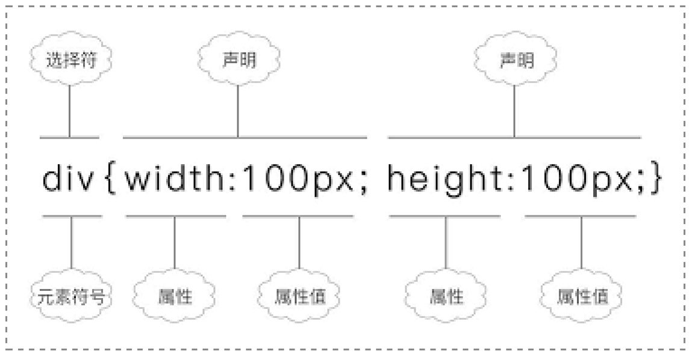
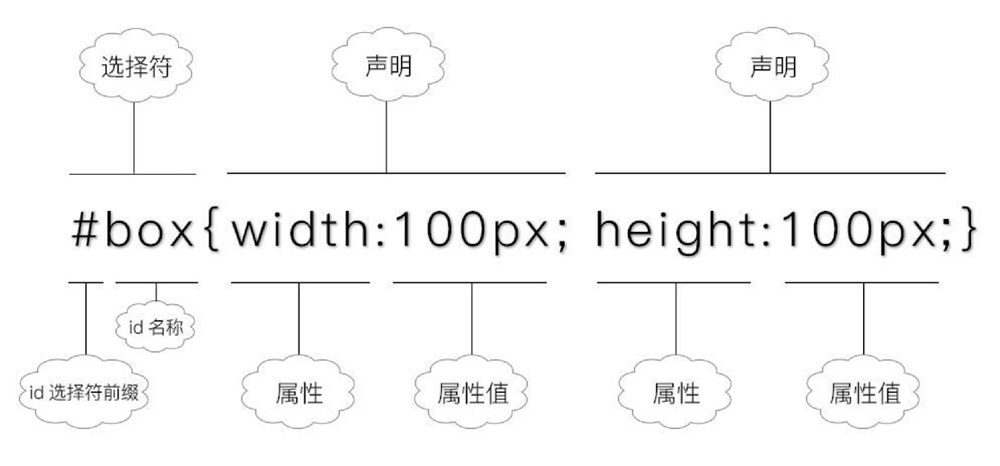
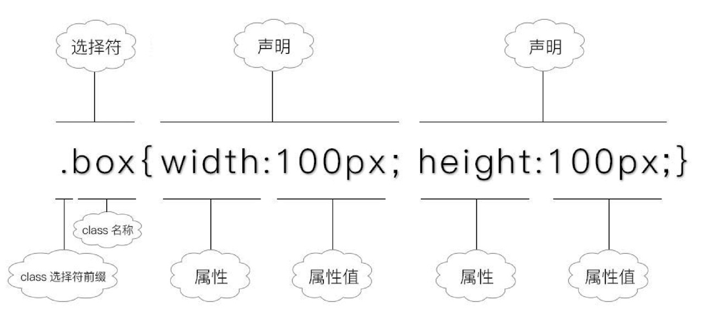
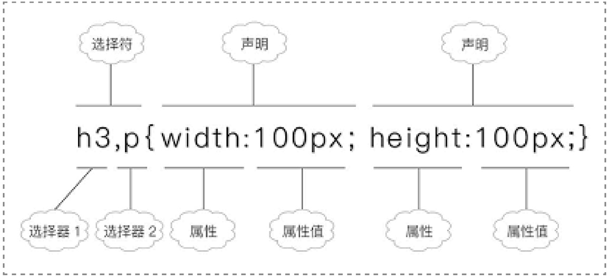
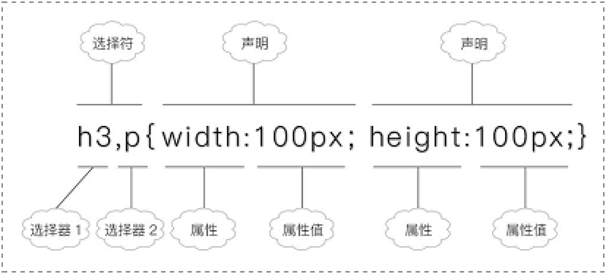

# CSS 选择器

## id

id属性具有唯一性，也就是说在一个页面中相同的id只能出现一次。

## class

我们可以为同一个页面的相同元素或者不同元素设置相同的class，然后使得具有相同class的元素具有相同的CSS样式。

>  因为在同一个页面中，允许出现两个相同class的元素。这样可以使得我们对具有相同class的多个元素定义相同的CSS样式。

## concept

选择器的不同，在于选择方式不同，但是它们的最终目的是相同的，那就是把你想要的元素选中，然后才可以定义该元素CSS样式。

### 格式

```CSS
选择器
{
    属性 1 : 取值 1;
    ……
    属性n : 取值n;
}
```

#### 元素选择器

元素选择器，就是“选中”相同的元素，然后给相同的元素定义同一个CSS样式。



```html
<head>
    <meta charset="utf-8"/>
    <title></title>
    <style>
         div{color:red;}​​    </style>
</head>
```

>  div{color:red;}表示把页面中所有的div元素选中，然后定义它们的文本颜色为红色。
> 
> p元素和span元素就没有被选中，因此这两个元素文本颜色就没有变红

#### id选择器

为元素设置一个id属性，然后针对设置了这个id的元素定义CSS样式，



>  对于id选择器，id名前面必须要加上前缀#，否则该选择器无法生效。在id名前面加上#，表示这是一个id选择器。对于id选择器，id名前面必须要加上前缀#，否则该选择器无法生效。在id名前面加上#，表示这是一个id选择器。

#### class选择器

相同的元素”或者“不同的元素”定义相同的class属性，然后针对拥有同一个class的元素进行CSS样式操作。



#### 后代选择器

就是选择元素内部中所有的某一种元素，包括子元素和其他后代元素（如孙元素）



```CSS
<style type="text/css">
        #father1 div {color:red;}​​        #father2 span{color:blue;}​​    </style>

<div id="father1">
        <div>绿叶学习网</div>
        <div>绿叶学习网</div>
    </div>
```

>  #father1 div {color:red;}表示选中id为father1的元素下的所有div元素，然后定义它们的文本颜色为红色

####  群组选择器



```CSS
<style type="text/css">
    h3,div,p,span{color:red;}
</style>
<!-- equals below -->
<style type="text/css">
    h3{color:red;}
    div{color:red;}
    p{color:red;}
    span{color:red;}
</style>
```


