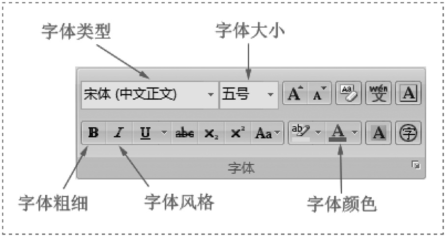
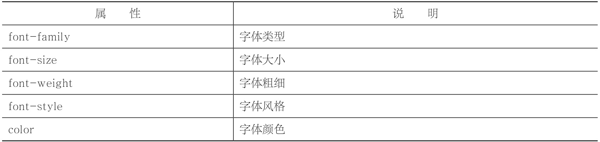
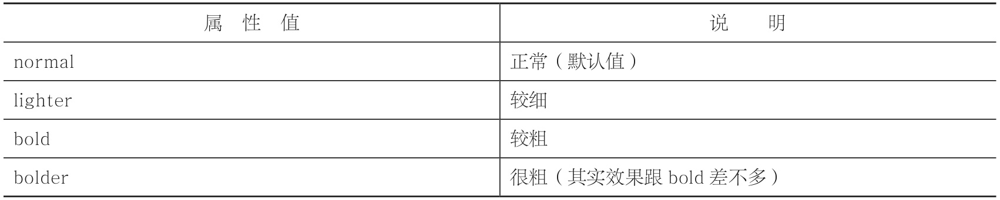
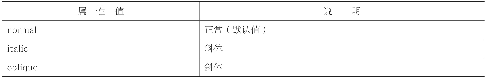

# 字体样式

- word 中的字体样式



- 字体样式属性



## 字体类型

```html
font-family: 字体 1, 字体 2, ..., 字体N;
<style type="text/css">
  #div1 {
    font-family: Arial;
  }
  #div2 {
    font-family: "Times New Roman";
  }
  #div3 {
    font-family: "微软雅黑";
  }
</style>

<style type="text/css">
  p {
    font-family: Arial, Verdana, Georgia;
  }
</style>
```

> 对于 font-family 属性，如果字体类型只有一个英文单词，则不需要加上双引号；如果字体类型是多个英文单词或者是中文，则需要加上双引号
>
> p{font-family:Arial,Verdana,Georgia;}这一句的意思是：p 元素优先使用 Aria 字体来显示，如果你的电脑没有装 Arial 字体，那就接着考虑 Verdana 字体。如果你的电脑还是没有装 Verdana 字体，那就接着考虑 Georgia 字体……

## 字体大小

```CSS
font-size:像素值;
```

> font-size 属性取值有两种，一种是“关键字”，如 small、medium、large 等。另外一种是“像素值”，如 10px、16px、21px 等。
> px，全称 pixel（像素）

## 字体粗细

```CSS
font-weight:取值;
```

> font-weight 属性取值有两种：一种是 100 ～ 900 的“数值”；另外一种是“关键字”。
>
> 

## 字体风格

```CSS
font-style:取值;
```

> 
>
> 有些字体有斜体 italic 属性，但有些字体却没有 italic 属性。oblique 是让没有 italic 属性的字体也能够有斜体效果。

## 字体颜色

```html
color:颜色值;

<style type="text/css">
  #p1 {
    color: gray;
  }
  #p2 {
    color: orange;
  }
  #p3 {
    color: red;
  }
</style>
<style type="text/css">
  #p1 {
    color: #03fca1;
  }
  #p2 {
    color: #048c02;
  }
  #p3 {
    color: #ce0592;
  }
</style>
```

> color 属性取值有两种：一种是“关键字”，另外一种是“16 进制 RGB 值”。除了这两种，其实还有 RGBA、HSL 等
>
> 浏览器解析 CSS 是有一定顺序的，在这个例子中，第二个 p 元素一开始就使用元素选择器定义了一次 color:red;，然后用 id 选择器定义了一次 color:blue;。因此后面的会覆盖前面的，最终显示为蓝色。
