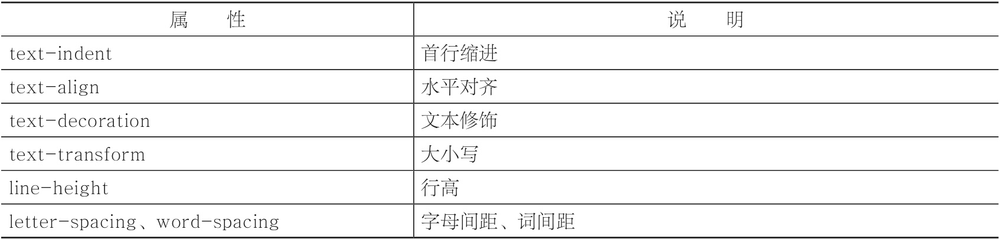
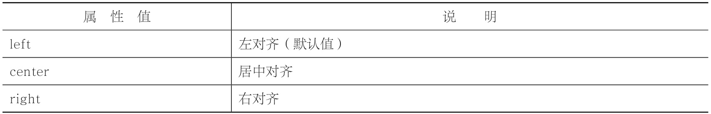
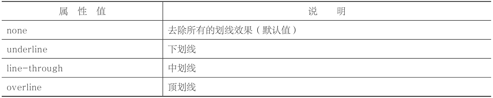
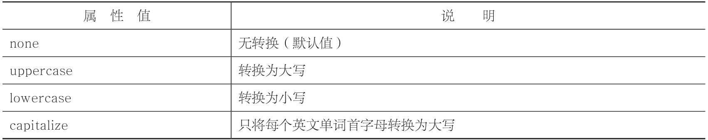

# 文本样式

字体样式针对的是“文字本身”的型体效果，而文本样式针对的是“整个段落”的排版效果。字体样式注重个体，文本样式注重整体。因此在CSS中，特意使用了font和text两个前缀来区分这两类样式。



## 首行缩进

使用text-indent属性来定义p元素的首行缩进。

```CSS
text-indent:像素值;
<style type="text/css">
        p{
            font-size:14px;​​            text-indent:28px;​​        }
    </style>
```

> 中文段落首行一般需要缩进两个字符。如果想要实现这个效果，text-indent值应该是font-size值的两倍。

## 水平对齐

```CSS
text-align:取值;
```



>  text-align属性不仅对文本有效，对图片（img元素）也有效。
## 文本修饰

```CSS
text-decoration:取值;

<style type="text/css">
        #p1{text-decoration:underline;}
        #p2{text-decoration:line-through;}
        #p3{border-top: 1px solid #000;padding-top: 0.1em;}
    </style>

<style type="text/css">
        a{text-decoration:none;}​​    </style>
```




> 超链接（a元素）默认样式有下划线 => “text-decoration:none;”

### 大小写
> 使用text-transform属性来将文本进行大小写转换



```CSS

text-transform:取值;

<style type="text/css">
        #p1{text-transform:uppercase;}
        #p2{text-transform:lowercase;}
        #p3{text-transform:capitalize;}
    </style>
```

### 行高

```CSS
line-height:像素值;

<style type="text/css">
        #p1{line-height:15px;}
        #p2{line-height:20px;}
        #p3{line-height:25px;}
    </style>
```

### 间距

- 字间距
```CSS
letter-spacing:像素值;

<style type="text/css">
        #p1{letter-spacing:0px;}
        #p2{letter-spacing:3px;}
        #p3{letter-spacing:5px;}
    </style>
```

- 词间距

```CSS
word-spacing:像素值;
```


