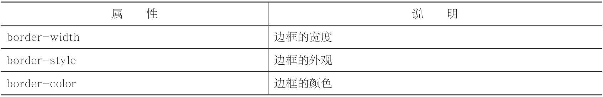
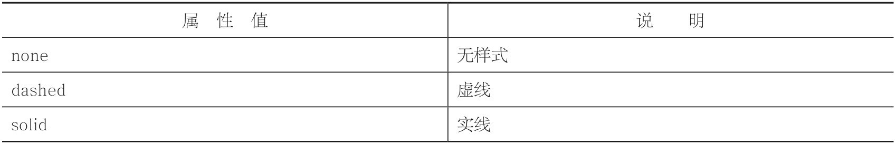
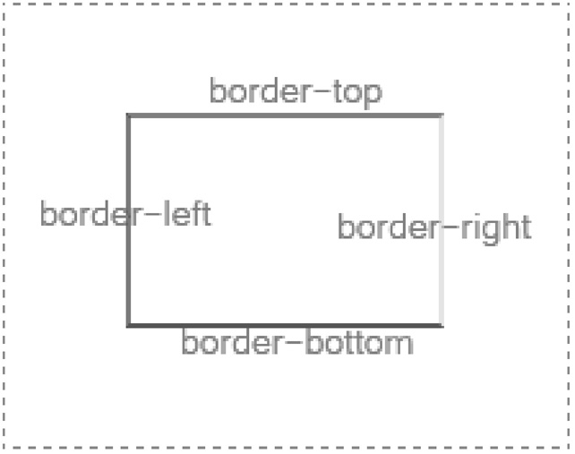

# 边框样式

几乎可以对所有的元素定义边框。例如，可以对div元素定义边框，可以对img元素定义边框，可以对table元素定义边框，也可以对span元素定义边框

需要设置三个方面:

-  边框宽度
-  边框外观（实线、虚线等）
-  边框颜色



想要为一个元素定义边框样式，必须要同时设置border-width、border-style、border color这三个属性才会有效果。

 - border-style



- 整体样式

```CSS

<!DOCTYPE html>
<html>
<head>
    <meta charset="utf-8" />
    <title></title>
    <style type="text/css">
        /*定义所有div样式*/
        div
        {
            width:100px;
            height:30px;
        }
        /*定义单独div样式*/
        #div1{border:1px dashed red;}​​        #div2{border:1px solid red;}​​    </style>
</head>
<body>
    <div id="div1"></div>
    <div id="div2"></div>
</body>
</html>

<style type="text/css">
        img
        {
            border-width: 2px;​​            border-style:solid;​​            border-color:red;​​        }
    </style>

border:1px solid red;
/* equals below */

border-width:1px;
border-style:solid;
border-color:red;

```

- 局部样式

```CSS
/* 上边框border-top */
border-top-width:1px;
border-top-style:solid;
border-top-color:red;

border-top:1px solid red;
```




> border-bottom:0px;、border-bottom:0;和border-bottom:none;这三个是等价的。


