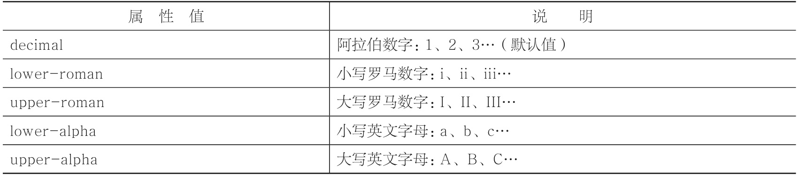
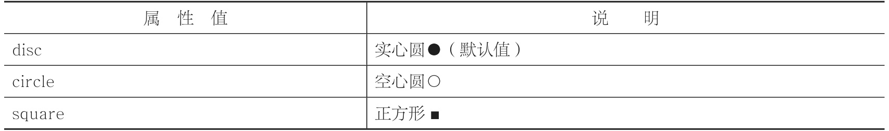

# 列表样式

## 列表项符号

```CSS
list-style-type:取值;
```

list-style-type属性是针对ol或者ul元素的，而不是li元素。

- 有序列表



- 无序列表



```CSS
<style type="text/css">
        ol{list-style-type:lower-roman;}​​    </style>
```

- 去除列表项符号

```CSS
list-style-type:none;
```


## 列表项图片

```CSS
list-style-image:url(图片路径);

<style type="text/css">
        ul{list-style-image: url(img/leaf.png);}​​    </style>
```
> 一般情况下我们都不会用list-style-image属性来实现，而是使用更为高级的字体图标（iconfont）技术来实现。


