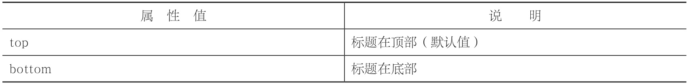
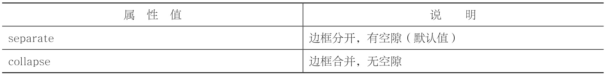

# 表格样式

## 表格标题位置

```html
caption-side:取值;

<!DOCTYPE html>
<html>
  <head>
    <meta charset="utf-8" />
    <title></title>
    <style type="text/css">
      table,th,td{border:1px solid silver;}        table{caption-side:bottom;}​​
    </style>
  </head>
  <body>
    <table>
      <caption>
        表格标题
      </caption>
      <!--表头-->
      <thead>
        <tr>
          <th>表头单元格 1</th>
          <th>表头单元格 2</th>
        </tr>
      </thead>
      <!--表身-->
      <tbody>
        <tr>
          <td>表行单元格 1</td>
          <td>表行单元格 2</td>
        </tr>
        <tr>
          <td>表行单元格 3</td>
          <td>表行单元格 4</td>
        </tr>
      </tbody>
      <!--表脚-->
      <tfoot>
        <tr>
          <td>表行单元格 5</td>
          <td>表行单元格 6</td>
        </tr>
      </tfoot>
    </table>
  </body>
</html>
```



## 表格边框合并

```html
border-collapse:取值;

<style type="text/css">
  table,th,td{border:1px solid silver;}        table{border-collapse: collapse;}​​
</style>
```



## 表格边框间距

```CSS
border-spacing:像素值;
```
