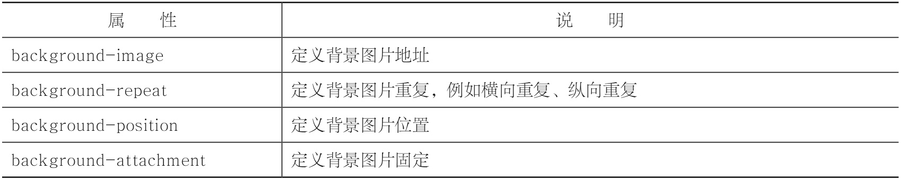
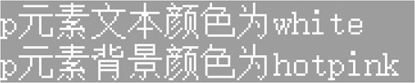
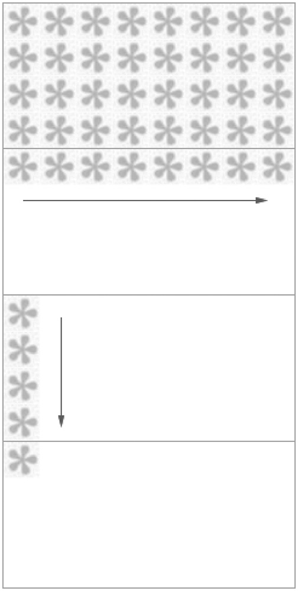
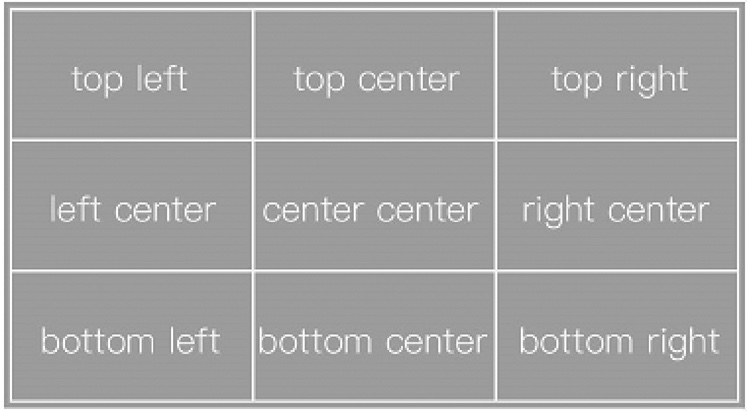
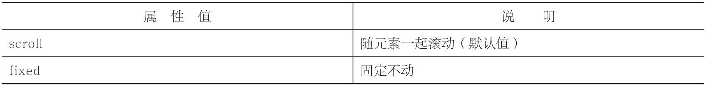

# 背景样式

## 属性



## 背景颜色

```html
background-color:颜色值;

<style type="text/css">
  p        {            color:white;            background-color: hotpink;​​        }
</style>
```



> color 属性用于定义“文本颜色”，而 background-color 属性用于定义“背景颜色”

## 背景图片样式

```html
background-image:url(图片路径);

<style type="text/css">
  div{background-image: url(img/haizei.png);}​​
</style>
```

> 没有给 div 元素定义 width 和 height，此时 div 元素的宽度和高度都为 0，那背景图片肯定不会显示啊

## 背景图片重复

```CSS
background-repeat:取值;
```


```html
<!DOCTYPE html>
<html>
  <head>
    <meta charset="utf-8" />
    <title></title>
    <style type="text/css">
      div {
        width: 200px;
        height: 100px;
        border: 1px solid silver;
        background-image: url(img/flower.png);
      }
      #div2 {
        background-repeat: repeat-x;
      }
      #div3 {
        background-repeat: repeat-y;
      }
      #div4 {
        background-repeat: no-repeat;
      }
    </style>
  </head>
  <body>
    <div id="div1"></div>
    <div id="div2"></div>
    <div id="div3"></div>
    <div id="div4"></div>
  </body>
</html>
```



> 在这个例子中，第一个 div 元素由于没有定义 background-repeat 属性值，因此会采用默认值 repeat。
>
> 此外还需要注意一点，元素的宽度和高度必须大于背景图片的宽度和高度，才会有重复效果。

## 背景图片位置

```CSS
background-position:像素值/关键字;

background-position:水平距离 垂直距离;
background-position:水平距离 垂直距离;

```

- 像素
  > 例如“background-position:12px 24px;”表示背景图片与该元素左上角的水平方向距离为 12px，垂直方向距离为 24px。
- 关键字
  

## 背景图片固定

```CSS
background-attachment:取值;
```


