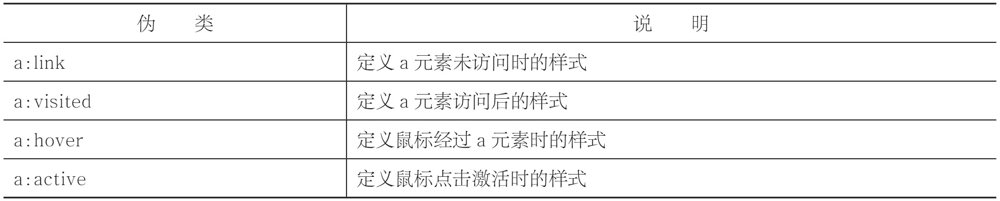
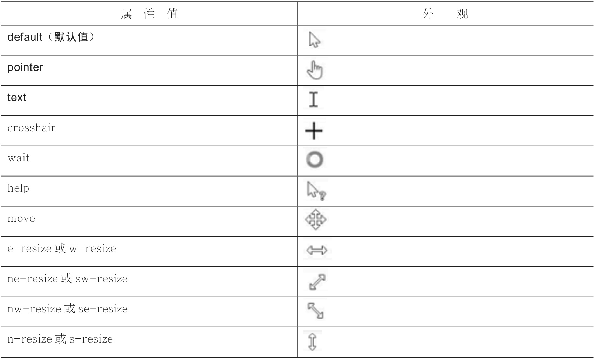

# 超链接样式

## 超链接伪类

-  默认情况下：字体为蓝色，带有下划线。
-  鼠标点击时：字体为红色，带有下划线。
-  鼠标点击后：字体为紫色，带有下划线。

```CSS
a:link{…}
a:visited{…}
a:hover{…}
a:active{…}
```



> 定义这四个伪类，必须按照link、visited、hover、active的顺序进行，不然浏览器可能无法正常显示这四种样式。请记住，这四种样式定义顺序不能改变。

```CSS
<!DOCTYPE html>
<html>
<head>
    <meta charset="utf-8" />
    <title> </title>
    <style type="text/css">
        a{text-decoration:none;}
        a:link{color:red;}​​        a:visited{color:purple;}a:hover{color:yellow;}​​        a:active{color:blue;}​​    </style>
</head>
<body>
    <a href="http://www.lvyestudy.com" target="_blank">绿叶学习网</a>
</body>
</html>
```

> a{text-decoration:none;}表示去掉超链接默认样式中的下划线

> 为什么我的浏览器中的超链接是紫色的呢？用color属性重新定义也无效，这是怎么回事？
> 
>如果某一个地址的超链接在之前被点击过，浏览器就会记下你的访问记录。那么下次你再用这个地址作为超链接地址时，由于之前你已经访问过了，当然就是紫色的啦。这时换一个地址就可以了。

> 事实上，:hover伪类可以定义任何一个元素在鼠标经过时的样式！注意，是任何元素喔。

```CSS

/* hover用于img元素 */
<style type="text/css">
        img:hover​​        {​​            border:2px solid red;
        }
    </style>
```

## 鼠标样式
- 浏览器鼠标样式
```CSS
cursor:取值;
```



```CSS
<!DOCTYPE html>
<html>
<head>
    <meta charset="utf-8" />
    <style type="text/css">
        div
        {
            width:100px;
            height:30px;
            line-height:30px;
            text-align:center;
            background-color: hotpink;
            color:white;
            font-size:14px;
        }
        #div_default{cursor:default;}​​        #div_pointer{cursor:pointer;}​​    </style>
</head>
<body>
    <div id="div_default">鼠标默认样式</div>
    <div id="div_pointer">鼠标手状样式</div>
</body>
</html>
```

- 自定义鼠标样式

```CSS
cursor:url(图片地址), 属性值;
```

> 鼠标图片后缀名一般都是.cur

```CSS
<!DOCTYPE html>
<html>
<head>
    <meta charset="utf-8" />
    <style type="text/css">
        div
        {
            width:100px;
            height:30px;
            line-height:30px;
            text-align:center;
            background-color: hotpink;
            color:white;
            font-size:14px;
        }
        #div_default{cursor:url(img/cursor/default.cur),default;}​​        #div_pointer{cursor:url(img/cursor/pointer.cur),pointer;}​​    </style>
</head>
<body>
    <div id="div_default">鼠标默认样式</div>
    <div id="div_pointer">鼠标手状样式</div>
</body>
</html>
```


