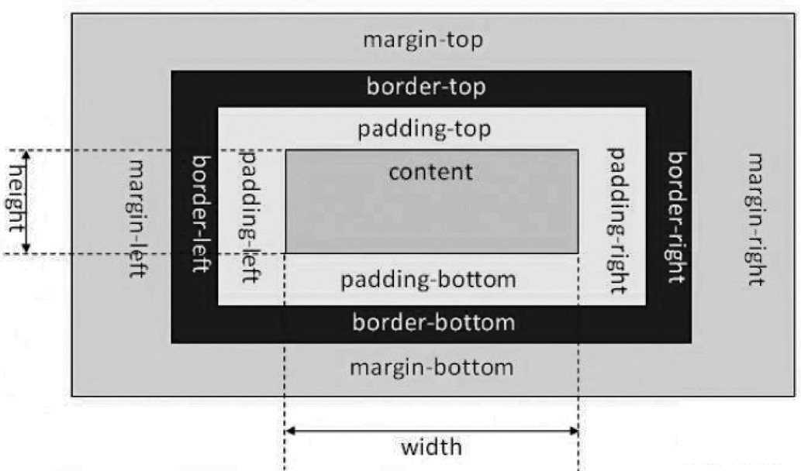
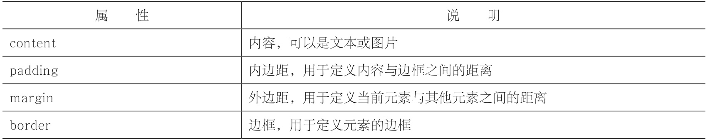
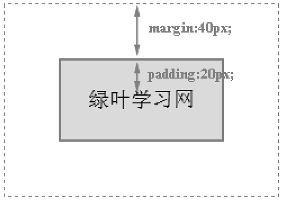
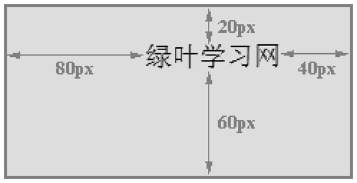
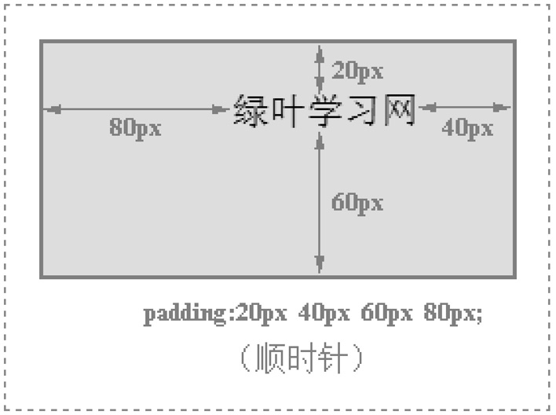
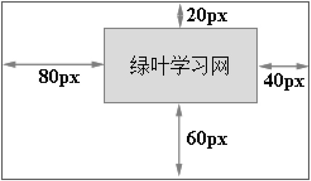
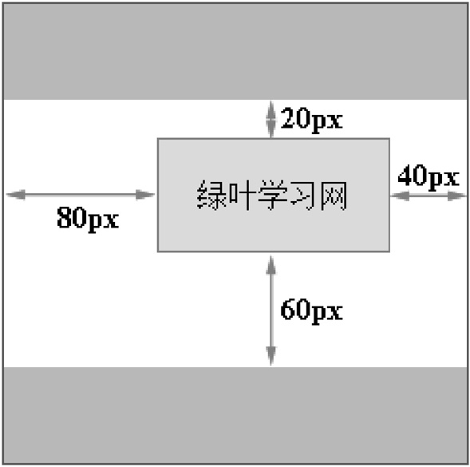
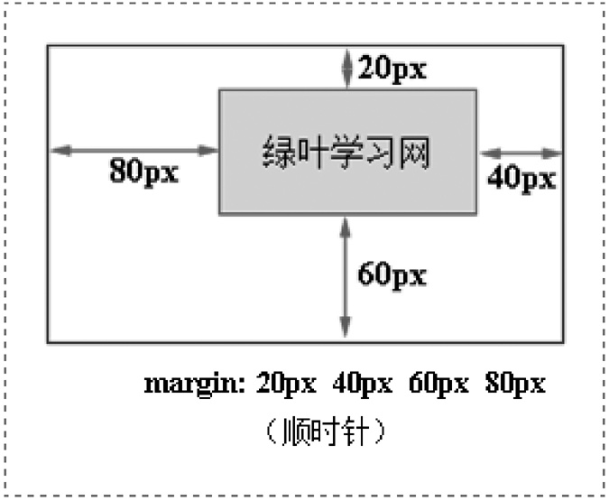

# 盒子模型

在CSS盒子模型理论中，页面中的所有元素都可以看成一个盒子，并且占据着一定的页面空间。



一个页面由很多这样的盒子组成，这些盒子之间会互相影响，因此掌握盒子模型需要从两个方面来理解：一是理解单独一个盒子的内部结构（往往是padding），二是理解多个盒子之间的相互关系（往往是margin）。

每个元素都看成一个盒子，盒子模型是由content（内容）、padding（内边距）、margin（外边距）和border（边框）这四个属性组成的。此外，在盒子模型中，还有宽度width和高度height两大辅助性属性。**记住，所有的元素都可以视为一个盒子**。



## 内容区

内容区有三个属性：width、height和overflow。

当内容过多超出width和height时，可以使用overflow属性来指定溢出处理方法。

## 内边距

内边距，指的是内容区和边框之间的空间，可以看成是内容区的背景区域。

关于内边距的属性有五种，即padding-top、padding-bottom、padding-left、padding-right以及综合了以上四个方向的简写内边距属性padding。


## 外边距

外边距，指的是两个盒子之间的距离，它可能是子元素与父元素之间的距离，也可能是兄弟元素之间的距离。外边距使得元素之间不必紧凑地连接在一起，是CSS布局的一个重要手段。

外边距的属性也有五种，即margin-top、margin-bottom、margin-left、margin-right以及综合了以上四个方向的简写外边距属性margin。


CSS允许给外边距属性指定负数值，当外边距为负值时，整个盒子将向指定负值的相反方向移动，以此可以产生盒子的重叠效果，这就是传说中的“负margin技术”。

## 边框

边框属性有border-width、border-style、border-color以及综合了三类属性的简写边框属性border。

border-width:1px;border-style:solid;border-color:gray;等价于border:1px solid gray;。

## example

```CSS
<!DOCTYPE html>
<html>
<head>
    <meta charset="utf-8" />
    <title></title>
    <style type="text/css">
        div
        {
            display:inline-block; /*将块元素转换为inline-block元素*/
            padding:20px;​​            margin:40px;​​            border:2px solid red;​​            background-color:#FFDEAD;
        }
    </style>
</head>
<body>
    <div>绿叶学习网</div>
</body>
</html>
```



-  padding是在元素内部，而margin是在元素外部。
-  margin看起来不属于div元素的一部分，实际上div元素的盒子模型是包含margin的。

> display:inline-block;表示将元素转换为行内块元素（即inline-block），其中inline-block元素的宽度是由内容区撑起来的。我们之所以在这个例子中将元素转换为inline-block元素，也是为了让元素的宽度由内容区撑起来，以便更好地观察。

## 宽和高
> 元素的宽度（width）和高度（height）是针对内容区而言的。
> 
> 只有块元素才可以设置width和height，行内元素是无法设置width和height的（我们这里不考虑inline-block元素）。
> 
> div是块元素，因此可以设置width和height。span是行内元素，因此不可以设置width和height。
> 
> 要是没有给块元素设置width，那么块元素就会延伸到整行
> 
> 行内元素设置的width和height无法生效，它的宽度和高度只能由内容区撑起来。
> 如果我们想要为行内元素（如span等）设置宽度和高度，那该怎么办呢？
> 
> 在CSS中，我们可以使用display属性来将行内元素转换为块元素，也可以将块元素转换为行内元素。

### padding局部样式
```CSS
padding-top:像素值;
padding-right:像素值;
padding-bottom:像素值;
padding-left:像素值;

<!DOCTYPE html>
<html>
<head>
    <meta charset="utf-8" />
    <title></title>
    <style type="text/css">
        div
        {
            display:inline-block; /*将块元素转换为inline-block元素*/
            padding-top:20px;​​            padding-right:40px;​​            padding-bottom:60px;​​            padding-left:80px;​​            border:2px solid red;
            background-color:#FFDEAD;
        }
    </style>
</head>
<body>
    <div>绿叶学习网</div>
</body>
</html>
```



padding:20px;表示四个方向的内边距都是20px。

padding:20px 40px;表示padding-top和padding-bottom为20px，padding-right和padding-left为40px。

padding:20px 40px 60px 80px;表示padding-top为20px，padding-right为40px，padding-bottom为60px，padding-left为80px。大家按照顺时针方向记忆就可以了。




### 外边距

```CSS
margin-top:像素值;
margin-right:像素值;
margin-bottom:像素值;
margin-left:像素值;
```

### 外边距

```CSS
margin-top:像素值;
margin-right:像素值;
margin-bottom:像素值;
margin-left:像素值;
```

- 只有父元素，没有兄弟元素时

```CSS
<!DOCTYPE html>
<html>
<head>
    <meta charset="utf-8" />
    <title></title>
    <style type="text/css">
        #father
        {
            display: inline-block; /*将块元素转换为inline-block元素*/
            border:1px solid blue;
        }
        #son
        {
            display:inline-block; /*将块元素转换为inline-block元素*/
            padding:20px;
            margin-top:20px;​​            margin-right:40px;​​            margin-bottom:60px;​​            margin-left:80px;​​            border:1px solid red;
            background-color:#FFDEAD;
        }
    </style>
</head>
<body>
    <div id="father">
        <div id="son">绿叶学习网</div>
    </div>
</body>
</html>
```




- 有兄弟元素时

```CSS
<!DOCTYPE html>
<html>
<head>
    <meta charset="utf-8" />
    <title></title>
    <style type="text/css">
        #father
        {
            display: inline-block; /*将块元素转换为inline-block元素*/
            border:1px solid blue;
        }
        #son
        {
            display:inline-block;/*将块元素转换为inline-block元素*/
            padding:20px;
            margin-top:20px;​​            margin-right:40px;​​            margin-bottom:60px;​​            margin-left:80px;​​            border:1px solid red;
            background-color:#FFDEAD;
        }
        .brother
        {
            height:50px;
            background-color:lightskyblue;
        }
    </style>
</head>
<body>
    <div id="father">
        <div class="brother"></div>
        <div id="son">绿叶学习网</div>
        <div class="brother"></div>
    </div>
</body>
</html>
```



> 当既有父元素，也有兄弟元素时，该元素会先看看四个方向有没有兄弟元素存在。如果该方向有兄弟元素，则这个方向的margin就是相对于兄弟元素而言。如果该方向没有兄弟元素，则这个方向的margin就是相对于父元素而言。
> 
> padding和margin的区别在于：padding体现的是元素的“内部结构”，而margin体现的是元素之间的相互关系。

margin:20px;表示四个方向的外边距都是20px。

margin:20px 40px;表示margin-top和margin-bottom为20px，margin-right和margin-left为40px。

margin:20px 40px 60px 80px;表示margin-top为20px，margin-right为40px，margin bottom为60px，margin-left为80px。大家按照顺时针方向记忆就可以了。



