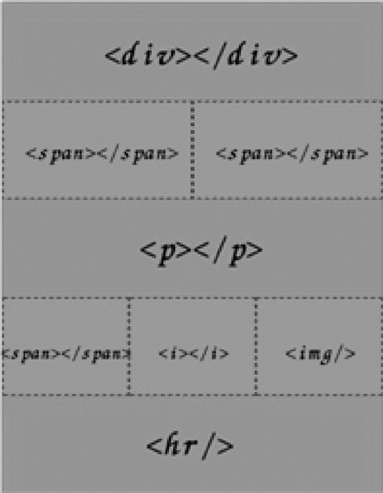
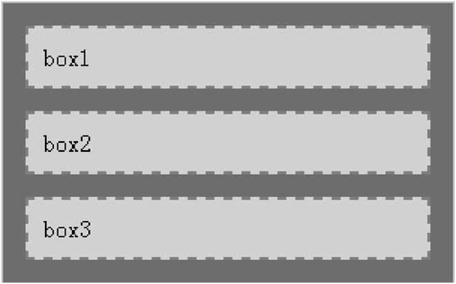
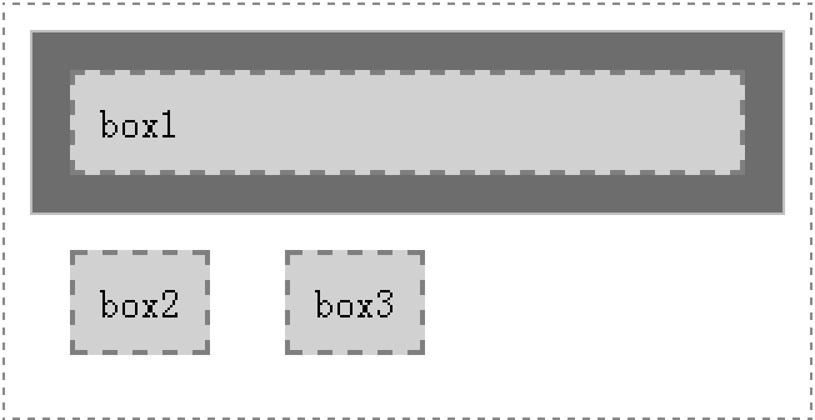
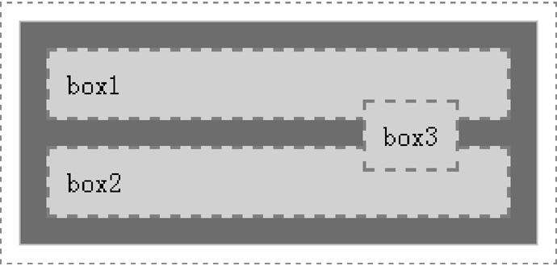
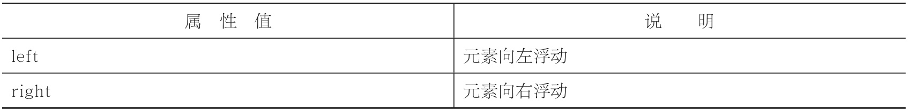
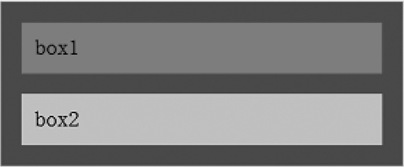
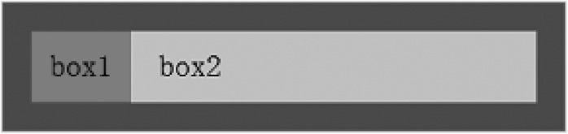
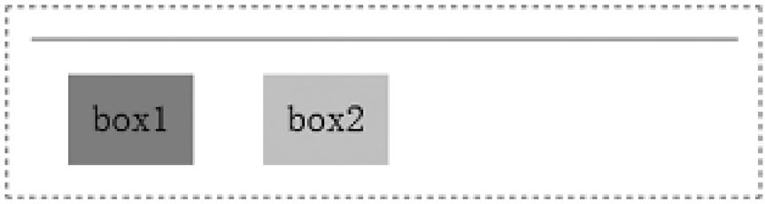
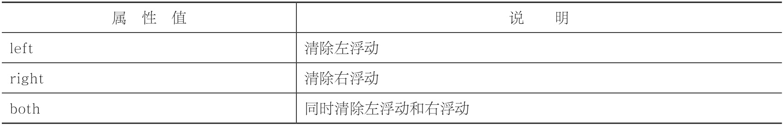

# 浮动布局

## 正常文档流

正常文档流，又称为“普通文档流”或“普通流”, “normal flow”


简单定义：“正常文档流，将一个页面从上到下分为一行一行的，其中块元素独占一行，相邻行内元素在每一行中按照从左到右排列直到该行排满。”也就是说，正常文档流指的就是默认情况下页面元素的布局情况。

```html
<!DOCTYPE html>
<html>
<head>
    <meta charset="utf-8" />
    <title></title>
</head>
<body>
    <div></div>
    <span></span><span></span>
    <p></p>
    <span></span><i></i>
    
    <hr />
</body>
</html>
```



> 由于div、p、hr都是块元素，因此独占一行。而span、i、img都是行内元素，因此如果两个行内元素相邻，就会位于同一行，并且从左到右排列。

## 脱离文档流


脱离文档流，指的是脱离正常文档流。正常文档流就是我们没有使用浮动或者定位去改变的默认情况下的HTML文档结构。换句话说，如果我们想要改变正常文档流，可以使用两种方法：浮动和定位。


```html
<!DOCTYPE html>
<html>
<head>
    <meta charset="utf-8" />
    <title></title>
</head>
    <style type="text/css">
        /*定义父元素样式*/
        #father
        {
            width:300px;
            background-color:#0C6A9D;
            border:1px solid silver;
        }
        /*定义子元素样式*/
        #father div
        {
            padding:10px;
            margin:15px;
            border:2px dashed red;
            background-color:#FCD568;
        }
    </style>
</head>
<body>
    <div id="father">
        <div id="son1">box1</div>
        <div id="son2">box2</div>
        <div id="son3">box3</div>
    </div>
</body>
</html>
```



- 设置浮动

当我们为第二、三个div元素设置左浮动时




> 由于设置了浮动，第二、三个div元素却是并列一行，并且跑到父元素之外

- 设置定位

当我们为第三个div元素设置绝对定位的时候





由于设置了定位，第三个div元素跑到父元素的上面去了。


## 浮动

我们已经知道浮动（即float属性）

```CSS
float:取值;
```
- float属性取值


```html
<!DOCTYPE html>
<html>
<head>
    <meta charset="utf-8" />
    <title></title>
    <style type="text/css">
        /*定义父元素样式*/
        #father
        {
            width:300px;
            background-color:#0C6A9D;
            border:1px solid silver;
        }
        /*定义子元素样式*/
        #father div
        {
            padding:10px;
            margin:15px;
        }
        #son1
        {
            background-color:hotpink;
            /*这里设置son1 的浮动方式*/
        }
        #son2
        {
            background-color:#FCD568;
            /*这里设置son2 的浮动方式*/
        }
    </style>
</head>
<body>
    <div id="father">
        <div id="son1">box1</div>
        <div id="son2">box2</div>
    </div>
</body>
</html>
```



在这个代码中，定义了三个div块，一个是父块，另外两个是它的子块。为了便于观察，我们为每一个块都加上了背景颜色，并且在块与块之间加上了一定的外边距。


从上图可以看出，如果两个子块都没有设置浮动，由于div是块元素，因此会各自向右延伸，并且自上而下排列。

- 设置第一个div浮动

```CSS
#son1
{
    background-color:hotpink;
    float:left;​​}
```



由于box1设置为左浮动，box1变成了浮动元素，因此此时box1的宽度不再延伸，而是由内容宽度决定其宽度。接着相邻的下一个div元素（box2）就会紧贴着box1，这是浮动引起的效果。

- 设置第二个div浮动

```CSS
#son2
{
    background-color:#FCD568;
    float:left;
}
```




由于box2变成了浮动元素，因此box2也跟box1一样，宽度不再延伸，而是由内容确定宽度。如果box2后面还有其他元素，则其他元素也会紧贴着box2。

怎么父元素变成一条线了呢？其实这是浮动引起的问题。

在正常文档流的情况下，块元素都是独占一行的。如果想要使两个或者多个块元素并排在同一行，这个时候可以考虑使用浮动，通过将块元素脱离正常文档流来实现。

浮动，可以使得元素移到左边或者右边，并且允许后面的文字或元素环绕着它。浮动最常用于实现水平方向上的并排布局，例如两列布局、多列布局，

### 清除浮动

```CSS
clear:取值;
```
- clear属性取值


```html
<!DOCTYPE html>
<html>
<head>
    <meta charset="utf-8" />
    <title></title>
    <style type="text/css">
        /*定义父元素样式*/
        #father
        {
            width:300px;
            background-color:#0C6A9D;
            border:1px solid silver;
        }
        /*定义子元素样式*/
        #father div
        {
            padding:10px;
            margin:15px;
        }
        #son1
        {
            background-color:hotpink;
            float:left; /*左浮动*/
        }
        #son2
        {
            background-color:#FCD568;
            float:right; /*右浮动*/
        }
        .clear{clear:both;}​​    </style>
</head>
<body>
    <div id="father">
        <div id="son1">box1</div>
        <div id="son2">box2</div>
        <div class="clear"></div>​​    </div>
</body>
</html>
```

一般都是在浮动元素后面再增加一个空元素，然后为这个空元素定义clear:both;来清除浮动。

清除浮动不仅仅只有clear:both;，还有overflow:hidden，以及更为常用的伪元素。


