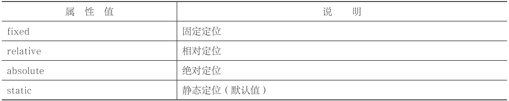

# 定位布局

CSS 定位使你可以将一个元素精确地放在页面上你指定的地方。结合使用定位和浮动，能够创建多种高级而精确的布局。其中，布局定位共有四种方式。

- 固定定位（fixed）
- 相对定位（relative）
- 绝对定位（absolute）
- 静态定位（static）

- position 属性取值
  

## 固定定位

所谓的固定定位，指的是被固定的元素不会随着滚动条的拖动而改变位置。

```html
position:fixed;top:像素值;bottom;像素值;left:像素值;right:像素值;

<style type="text/css">
  #first {
    width: 120px;
    height: 1800px;
    border: 1px solid gray;
    line-height: 600px;
    background-color: #b7f1ff;
  }
  #second {
    position: fi xed; /*设置元素为固定定位*/
    top: 30px; /*距离浏览器顶部 30px*/
    left: 160px; /*举例浏览器左部 160px*/
    width: 60px;
    height: 60px;
    border: 1px solid silver;
    background-color: hotpink;
  }
</style>
```

尝试拖动浏览器的滚动条，其中有固定定位的 div 元素不会有任何位置改变，但没有定位的 div 元素会改变

> 固定定位最常用于实现返回顶部功能

## 相对定位

所谓的相对定位，指的是该元素的位置是相对于它的原始位置计算而来的。

固定定位元素的位置是相对浏览器而言，而相对定位元素的位置是相对于原始位置而言！

```html
position:relative;top:像素值;bottom;像素值;left:像素值;right:像素值; #son2{
position:relative; top:20px; left:40px;}
```


## 绝对定位

一个元素变成了绝对定位元素，这个元素就完全脱离文档流了，绝对定位元素的前面或者后面的元素会认为这个元素并不存在，即这个元素浮于其他元素上面，它是独立出来的。

## 静态定位

元素 position 属性的默认值是 static。

JavaScript 来控制元素定位时，如果想要使得元素从其他定位方式变成静态定位，就需要使用 position:static 来实现。
