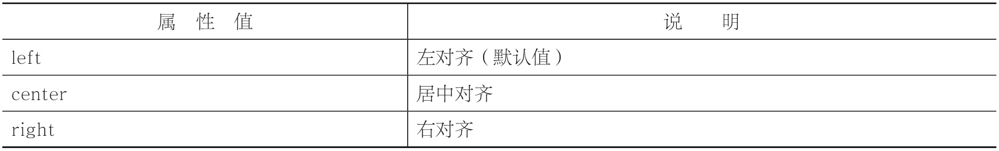

# 图片样式

## 图片大小

```CSS
width:像素值;height:像素值;

<style type="text/css">        img        {        width:60px;​​        height:60px;​​        }    </style>
```

## 图片边框

```CSS
border:1px solid red
```

## 图片对齐

```CSS
text-align:取值;
```



> text-align 属性一般只用于两个地方：文本水平对齐和图片水平对齐。

```html
<!DOCTYPE html>
<html>
  <head>
    <meta charset="utf-8" />
    <title></title>
    <style type="text/css">
      div {
        width: 300px;
        height: 80px;
        border: 1px solid silver;
      }
      .div1 {
        text-align: left;
      }
      ​​ .div2 {
        text-align: center;
      }
      .div3 {
        text-align: right;
      }
      ​​ img {
        width: 60px;
        height: 60px;
      }
    </style>
  </head>
  <body>
    <div class="div1"></div>
    <div class="div2"></div>
    <div class="div3"></div>
  </body>
</html>
```

> 很多人以为图片的水平对齐是在 img 元素中定义，其实这是错误的。图片是在父元素中进行水平对齐，因此我们当然是在图片的父元素中定义啦。
>
> 在这个例子中，img 的父元素是 div，因此想要实现图片的水平对齐，就应该在 div 中定义 text align 属性。

## 垂直对齐

```html
vertical-align:取值;

<style type="text/css">
  img{width:60px;height:60px;}
  #img1{vertical-align:top;}​​
  #img2{vertical-align:middle;}​​
  #img3{vertical-align:bottom;}​​
  #img4{vertical-align:baseline;}​​
</style>
```


## 文字环绕

```html
float:取值;

<style type="text/css">
  img {
    float: left;
  }
  ​​ p {
    font-family: "微软雅黑";
    font-size: 12px;
  }
</style>
```


