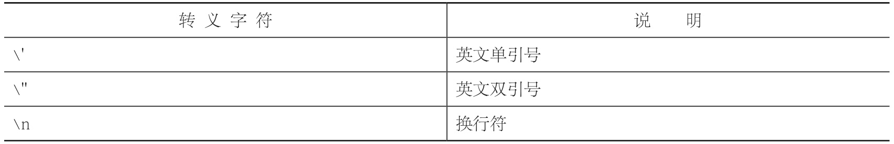

# 语法基础

## 变量的命名

-  变量由`字母、下划线、$或数字组成，并且第一个字母必须是“字母、下划线或$”`。
-  变量不能是系统关键字和保留字

## 变量的使用

所有JavaScript变量都是由var声明。

```Javascript
var a=10,b=20,c=30;
```
## 常量

一般情况下，常量名全部大写，别人一看就知道这个值很特殊，有特殊用途

```Javascript
var DEBUG = 1;
```

## 数据类型

数据类型可以分为两种：一种是“基本数据类型”，另外一种是“引用数据类型”

- 基本数据类型

数字、字符串、布尔值、未定义值和空值。

- 常见的引用数据类型

数组、对象。


凡是已经用var来声明但没有赋值的变量，值都是undefined。

如果一个变量的值等于null，如var n = null;，则表示系统没有给这个变量n分配内存空间。

- 换行

document.write(a + "<br/>" + b + "<br/>" + c); 

## 类型转换

### “字符串”转换为“数字”

- Number()
Number()方法可以将任何“数字型字符串”转换为数字。

那什么是数字型字符串呢？像"123"、"3.1415"等这些只有数字的字符串就是“数字型字符串”，而"hao123"、"100px"等就不是。

- parseInt()和parseFloat();
parseInt()和parseFloat是提取“首字母为数字的任意字符串”中的数字，其中parseInt()提取的是整数部分，parseFloat()不仅会提取整数部分，还会提取小数部分。

提取类似"100px"中的数字


不符合要求返回NaN

数字加上字符串，系统会将数字转换成字符串。如果想要将一个数字转换为字符串，而又不增加多余的字符，我们可以将这个数字加上一个空字符串。

a.toString()表示将a转换为字符串

## 转义字符



-  如果是在document.write()中换行，则应该用`<br/>`。
-  如果是在alert()中换行，则应该用`\n`。


## 注释


//单行注释

`/*多行注释*/`


