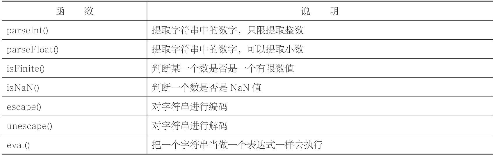

# 函数

```Javascript
function 函数名(参数 1 , 参数 2 ,..., 参数n)
{
    ……
    return 返回值;
}
```

## 全局变量与局部变量

## 函数的调用

-  直接调用
-  在表达式中调用
-  在超链接中调用
-  在事件中调用

### 在超链接中调用

```html
<a href="javascript:函数名"></a>
```
> 当我们点击了超链接之后，就会调用函数

### 在事件中调用

JavaScript是基于事件的一门语言

```html
<body>
    <input type="button" onclick="alertMes()" value="提交" />
</body>
```

## 嵌套函数

嵌套函数，简单来说，就是在一个函数的内部定义另外一个函数。不过在内部定义的函数只能在内部调用，如果在外部调用，就会出错。

```Javascript
//定义阶乘函数
        function func(a)
        {
            //嵌套函数定义，计算平方值的函数
            function multi (x)
            {
                return x*x;
            }
            var m=1;
            for(var i=1;i<=multi(a);i++)
            {
                m=m*i;
            }
            return m;
        }
```

嵌套函数功能是非常强大的，并且跟JavaScript最重要的一个概念“闭包”有着直接的关系。

## 内置函数




