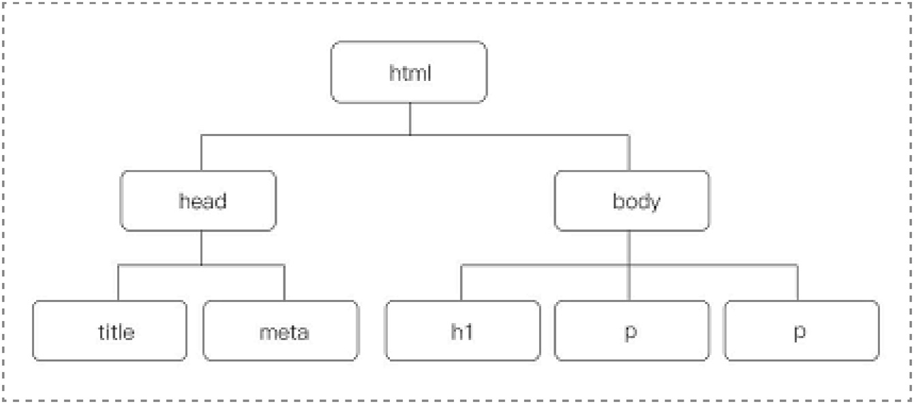
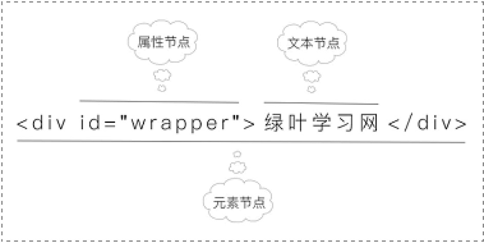
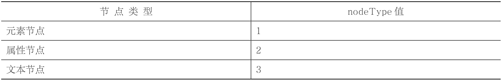

# DOM基础

## DOM对象

DOM，全称Document Object Model（文档对象模型），它是由W3C定义的一个标准。

DOM操作，可以简单理解成“元素操作”。

### DOM结构

DOM采用的是“树形结构”，用“树节点”形式来表示页面中的每一个元素。

```html
<!DOCTYPE html>
<html>
<head>
    <meta charset="utf-8" />
    <title></title>
<body>
    <h1>绿叶学习网</h1>
    <p>绿叶学习网是一个……</p>
    <p>绿叶学习网成立于……</p>
</body>
</html>
```

- DOM树



利用这种简单的“家谱关系”，我们可以把各节点之间的关系清晰地表达出来。

也是为了更好地给每一个元素进行定位

每一个元素就是一个节点，而每一个节点就是一个对象。也就是说，我们在操作元素时，其实就是把这个元素看成一个对象，然后使用这个对象的属性和方法来进行相关操作

## 节点类型

DOM节点共有12种类型

常见的只有三种:

-  元素节点
-  属性节点
-  文本节点

```html
<div id="wrapper">绿叶学习网</div>
```

这里有三个节点




JavaScript会把元素、属性以及文本当做不同的节点。

节点跟元素是不一样的概念，节点是包括元素的。

使用nodeType属性来判断一个节点的类型。

- 不同节点的nodeType属性值
- 



-  一个元素就是一个节点，这个节点称之为“元素节点”。
-  属性节点和文本节点看起来像是元素节点的一部分，但实际上，它们是独立的节点，并不属于元素节点。
-  只有元素节点才可以拥有子节点，属性节点和文本节点都无法拥有子节点。

## 获取元素

获取元素，准确来说，就是获取元素节点（注意不是属性节点或文本节点）

-  getElementById()
-  getElementsByTagName()
-  getElementsByClassName()
-  querySelector()和querySelectorAll()
-  getElementsByName()
-  document.title和document.body

### getElementById

```html
<!DOCTYPE html>
<html>
<head>
    <meta charset="utf-8" />
    <title></title>
    <script>
        window.onload = function ()
        {
            var oDiv = document.getElementById("div1");
            oDiv.style.color = "red";
        }
    </script>
</head>
<body>
    <div id="div1">JavaScript</div>
</body>
</html>
```

> 这个例子的JavaScript代码在HTML代码的上面，如果没有window.onload，浏览器解析到document.getElementById("div1")就会报错，因为它不知道id为div1的元素究竟是哪位兄弟。
> 注意，getElementById()方法中的id是不需要加井号（#）的，如果你写成getElementById("#div1")就是错的。
> 一个DOM对象，我们在给变量命名的时候，习惯性地以“o”开头，以便跟其他变量区分开来，并且可以让我们一眼就看出来这是一个DOM对象。

### getElementsByTagName

getElementsByTagName()获取的是多个元素（即集合），而getElementById()获取的仅仅是一个元素。

实际上这个方法获取的是一个数组

oLi[i].innerHTML = arr[i];表示设置li元素中的内容为对应下标的数组arr中的元素。

 


