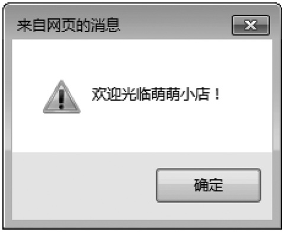
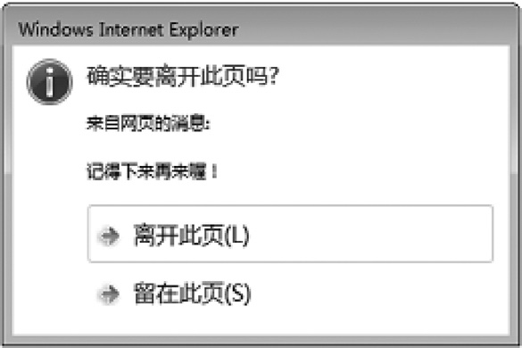

# 简介

HTML控制网页的结构，CSS控制网页的外观，而JavaScript控制网页的行为

-  学完JavaScript入门（也就是本书内容），不要急于去学习JavaScript进阶，而是应该去学jQuery。经过jQuery的学习，会让我们对JavaScript入门的知识有更深一层的理解。等我们学完了jQuery再去学习JavaScript进阶的内容。
-  很多人学习JavaScript的时候，喜欢在第一遍学习中就对每一个细节都扣清楚，事实上这是效率最低的学习方法。在第一遍学习时，如果有些东西我们实在没办法理解，那就直接跳过，等到学到后面或者看第二遍的时候，自然而然就懂了。

## 引入方式

一般有三种方式:
-  外部JavaScript
-  内部JavaScript
-  元素事件JavaScript

## 外部

外部JavaScript，指的是把HTML代码和JavaScript代码单独放在不同的文件中，然后在HTML文档中使用script标签来引入JavaScript代码。

```html
<!DOCTYPE html>
<html>
<head>
    <meta charset="utf-8" />
    <title></title>
    <!--1、在head中引入-->
    <script src="index.js"></script>​​</head>
<body>
    <!--2、在body中引入-->
    <script src="index.js"></script>​​</body>
</html>
```


## 内部

```html
<!DOCTYPE html>
<html>
<head>
    <meta charset="utf-8" />
    <title></title>
    <!--1、在head中引入-->
    <script>​​        ……
    </script>​​</head>
<body>
    <!--2、在body中引入-->
    <script>​​        ……
    </script>​​</body>
</html>
```

> 内部JavaScript文件不仅可以在head中引入，也可以在body中引入。一般情况下，我们都是在head中引入。
> 
> 实际上，<script></script>是一种简写形式，它其实等价于

```html
<script type="text/javascript">
……
</script>
```

```html
<!DOCTYPE html>
<html>
<head>
    <meta charset="utf-8" />
    <title></title>
    <script>
        document.write("绿叶学习网，给你初恋般的感觉～");
    </script>
</head>
<body>
</body>
</html>
```

> document.write()表示在页面输出一个内容

## 元素属性

元素属性JavaScript，指的是在元素的“事件属性”中直接编写JavaScript或调用函数。


- 在元素事件中编写
```html
<!DOCTYPE html>
<html>
<head>
    <meta charset="utf-8" />
    <title></title>
</head>
<body>
    <input type="button" value="按钮" onclick="alert('绿叶学习，给你初恋般的感觉')"/>​​</body>
</html>
```

- 在元素事件中调用函数

```html
<!DOCTYPE html>
<html>
<head>
    <meta charset="utf-8" />
    <title></title>
    <script>
        function alertMes()​​        {​​            alert("绿叶学习网，给你初恋般的感觉");​​        }​​    </script>
</head>
<body>
    <input type="button" value="按钮" onclick="alertMes()"/>​​</body>
</html>
```

## example

```html
<!DOCTYPE html>
<html>
<head>
    <meta charset="utf-8" />
    <title></title>
    <script>
        window.onload = function () {
            alert("欢迎光临萌萌小店！");
        }
        window.onbeforeunload = function (event) {
            var e = event || window.event;
            e.returnValue = "记得下来再来喔！";
        }
    </script>
</head>
<body>
</body>
</html>
```

- 打开时效果



- 关闭页面时效果




