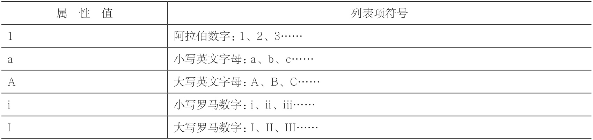

# 列表
```html
<ol>
    <li>列表项</li>
    <li>列表项</li>
    <li>列表项</li>
</ol>
<!-- use type -->
<ol type="属性值">
    <li>列表项</li>
    <li>列表项</li>
    <li>列表项</li>
</ol>
```
>  ol，即ordered list（有序列表）。li，即list（列表项）。
>  
